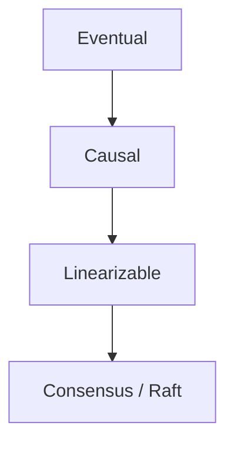
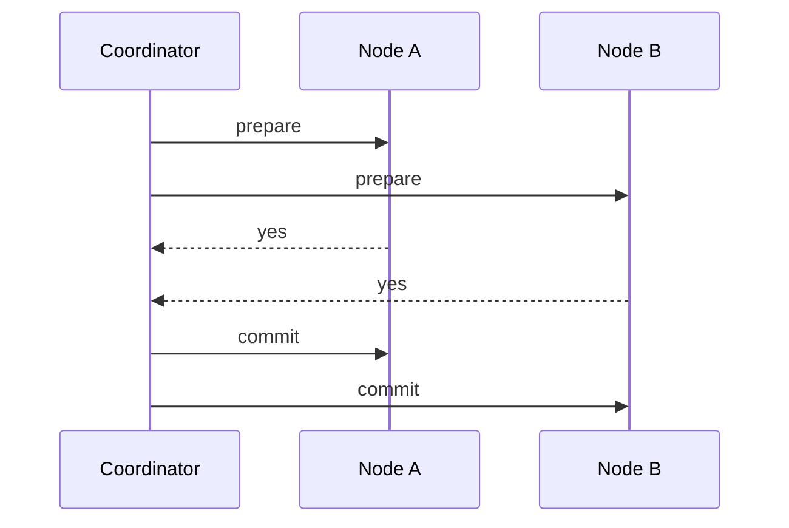

## What this chapter is about

Eventual consistency is easy to operate and easy to misuse. Stronger models cost latency or availability. Consensus is how nodes agree on leaders, order, and commits when intuition is not enough.

## Core ideas

### Linearizability

The system behaves as if there is one copy of the data and every operation is atomic — a **recency** guarantee. After any read sees `x=2`, all later reads must see that (or newer). Not the same as **serializability** (transaction isolation).

Single-leader + consensus can provide linearizability; multi-leader generally cannot; Dynamo-style only with painful caveats. CAP (informally): insist on linearizability during a partition and you sacrifice availability. Few systems are linearizable end-to-end because it is slow even on a healthy network.

### Ordering and causality

Causal consistency respects happens-before and is the strongest model that need not stall on network delay the way linearizability does. Tools: version vectors, Lamport timestamps, total-order broadcast. Lamport gives compact total order but cannot always detect concurrency the way version vectors can.

### Consensus and distributed transactions

Consensus: agree on a value (leader election, atomic commit). Impossible in fully async unreliable models in theory; practical with timeouts (Raft, Paxos, Zab, Viewstamped Replication).

**Two-phase commit**: prepare then commit; after a yes vote, participants may block if the coordinator dies. Operationally heavy; can freeze locks. Total-order broadcast ≈ repeated consensus and underpins many replication stories.

## Visual





## Code Example

*Snippets below use Java, SQL, or plain text as labeled.*

Linearizability vs serializability:

```text
Linearizability: after any read sees x=2, later reads see x>=2 (recency)
Serializability: transactions act as if run one-at-a-time (isolation)
```

Lamport bump:

```java
long onReceive(long remoteTs, long localTs) {
  return Math.max(remoteTs, localTs) + 1;
}
```

## Takeaways

- Linearizable ≠ serializable — different jobs
- Causal consistency is often the geo sweet spot
- Consensus is powerful; majority + membership + timeout sensitivity
