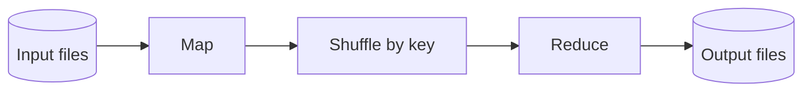
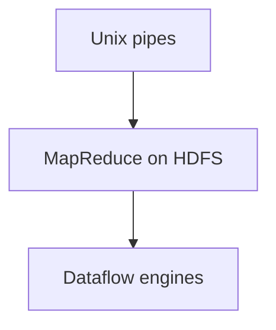

## What this chapter is about

Systems fall into three shapes: **online** (request/response), **batch** (bounded input → output, often scheduled), and **stream** (unbounded, near-real-time). Batch processing is the Unix philosophy at datacenter scale.

## Core ideas

### Unix tools as a design lesson

`awk`, `sort`, `uniq`, pipes: immutable inputs, composable programs, a uniform interface (bytes). You can interrupt a pipeline, materialize intermediate files, and retry. Limited to one machine — hence Hadoop-style systems.

### MapReduce

Mappers emit key/value pairs; shuffle groups by key; reducers aggregate. Inputs stay immutable; outputs land on a distributed filesystem (HDFS). Chain jobs into workflows. Joins use sort-merge / broadcast-hash / partitioned-hash patterns — prefer bringing data together over querying remote DBs mid-job. Build derived databases as files; avoid dual-writing live into OLTP from mappers.

### Beyond MapReduce

Fully materialized stages waste IO and block pipelines. **Dataflow engines** (Spark, Flink, …) treat a workflow as one job with richer operators, less redundant materialization, and faster iteration — trading some failure recovery for speed. High-level APIs (Hive, Spark SQL) shrink code and enable interactive use. Arbitrary code in operators is a superpower versus rigid SQL-only engines.

## Visual





## Code Example

*Snippets below use Java, SQL, or plain text as labeled.*

Unix pipeline:

```bash
gunzip -c events.log.gz \
  | awk '{print $1}' \
  | sort \
  | uniq -c \
  | sort -nr \
  | head
```

MapReduce word-count sketch:

```java
void map(String line, Emitter emitter) {
  for (String word : line.split("\\s+")) {
    emitter.emit(word, 1);
  }
}

void reduce(String word, Iterable<Integer> counts, Emitter emitter) {
  int sum = 0;
  for (int c : counts) sum += c;
  emitter.emit(word, sum);
}
```

## Takeaways

- Immutable inputs + derived outputs = retry-friendly
- Batch fits large, failure-prone jobs
- Dataflow engines keep the Unix idea without one-machine limits
