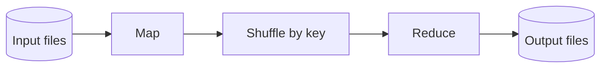

## Core ideas

Three system shapes: **online** (request/response), **batch** (bounded input → output), **stream** (unbounded, near-real-time).

Unix philosophy: immutable inputs, composable tools, pipes as the interface — limited to one machine.

**MapReduce** — map extracts key/values; reduce aggregates by key; HDFS-scale; chain jobs for workflows. Joins via sort-merge / hash variants; build outputs as new files, not live dual-writes into OLTP.

**Dataflow engines** (Spark, Flink, …) treat the whole workflow as one job, less materialization, faster iteration — recompute on failure instead of always checkpointing intermediates.

## Picture



## Code Example

<p class="notes-code-lang"><small>Snippets in Java, SQL, or pseudocode as labeled.</small></p>

### Unix pipeline

```bash
gunzip -c events.log.gz \
  | awk '{print $1}' \
  | sort \
  | uniq -c \
  | sort -nr \
  | head
```

### MapReduce word-count sketch

```java
void map(String line, Emitter emitter) {
  for (String word : line.split("\\s+")) {
    emitter.emit(word, 1);
  }
}

void reduce(String word, Iterable<Integer> counts, Emitter emitter) {
  int sum = 0;
  for (int c : counts) sum += c;
  emitter.emit(word, sum);
}
```

## Takeaways

- Immutable inputs + derived outputs = retry-friendly
- Batch fits large, failure-prone jobs
- Dataflow engines keep the Unix idea without one-machine limits
