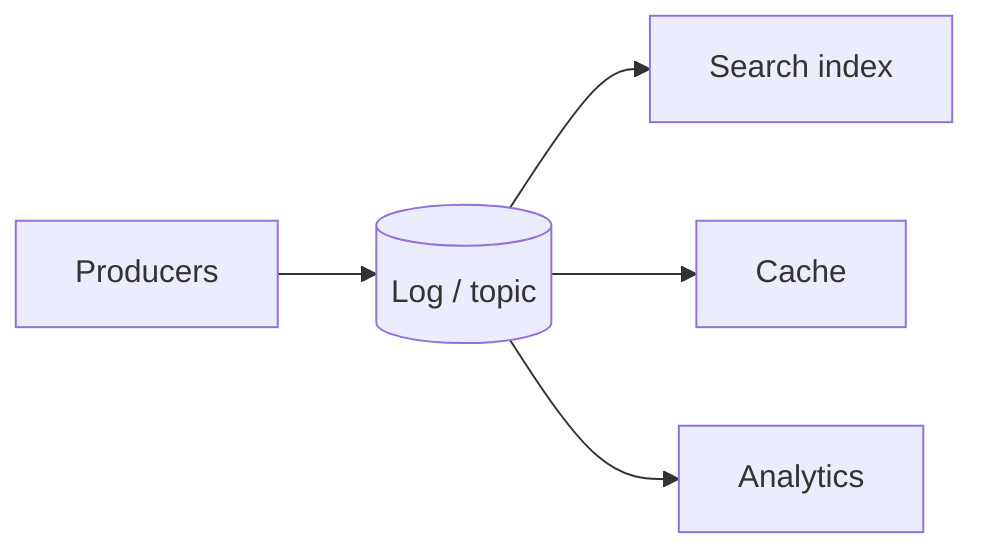

## Overview

Streams process **unbounded** event sequences with low lag. Where batch waits for a whole input set, streaming reacts to events as they arrive, monitoring, CDC, real-time analytics, derived views.

## Core ideas

### Transmitting events

Events are small, immutable, timestamped facts, grouped by topic. Messaging options: direct network (fast, loss-aware), classic brokers (buffer/retry/delete-on-ack), and **log-based brokers** (Kafka-style: durable, ordered, replayable, partitionable). Choose based on throughput, ordering needs, and processing cost.

### Databases as streams

Dual writes into two stores race and diverge. Prefer **change data capture** (database as leader; derived followers) or **event sourcing** (store commands/facts; derive state). Immutability aids audit and evolution; async consumers complicate read-your-writes. Log compaction keeps history bounded; true deletion remains hard.

### Processing streams

Write to datastores, push to users, or emit derived streams. Windows: tumbling, hopping, sliding, session, prefer **event time** with watermarks over pure processing time under lag. Joins need state and careful ordering. Fault tolerance via micro-batches, transactional sinks, or **idempotent** outputs.

## Visual




## Code Example

*Snippets below use Java, SQL, or plain text as labeled.*

Prefer CDC over dual write:

```java
// Fragile
db.save(user);
searchIndex.put(user);

// Better: one system of record; indexer follows CDC/binlog
db.save(user);
```

Idempotent sink:

```java
void upsert(Event e) {
  store.putIfAbsent(e.id(), e.payload());
}
```

Window mental model:

```text
Tumbling  [0,60) [60,120)
Hopping   [0,60) [30,90) [60,120)
Session   idle gap starts a new window
```

## In short

Prefer a log plus derived views over dual writes. Window on event time when lag exists. Make sinks idempotent because retries will happen.
