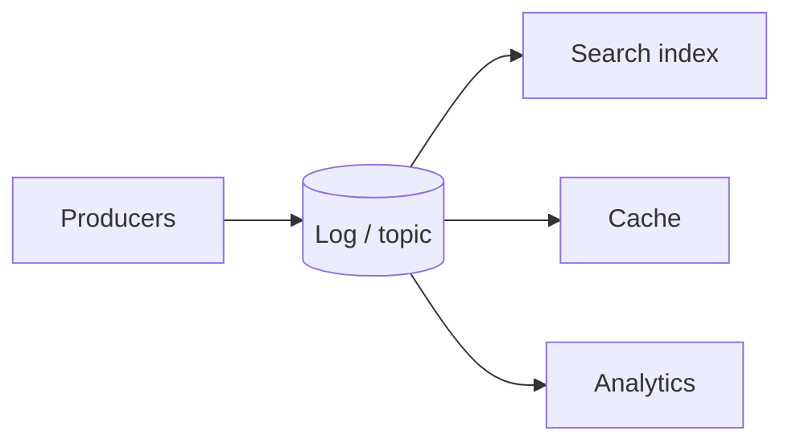

## Core ideas

Streams process **unbounded** event sequences with low lag. Events are small, immutable, timestamped; grouped by topic.

Messaging: direct (fast, loss-aware) vs **brokers** (buffer/retry) vs **log-based brokers** (Kafka-style: durable, ordered, replayable).

**CDC** and **event sourcing** turn the database into a leader of derived views — prefer over dual writes. Immutability helps audit/evolve; async consumers complicate read-your-writes.

Processing: CEP, windowed analytics (tumbling/hopping/sliding/session), stream-stream / stream-table joins. Fault tolerance via micro-batching, exactly-once-ish transactions, or **idempotent** sinks. Use event time, not only processing time.

## Picture




## Example

### Prefer CDC over dual write

```java
// Fragile: two writes, no shared order
db.save(user);
searchIndex.put(user);

// Better: one system of record, derived consumers
db.save(user); // binlog/CDC -> indexer updates search
```

### Idempotent sink

```java
void upsert(Event e) {
  store.putIfAbsent(e.id(), e.payload()); // retries safe
}
```

### Window types (mental model)

```text
Tumbling  [0,60) [60,120)
Hopping   [0,60) [30,90) [60,120)   # overlap by hop
Session   gaps > idle timeout start a new window
```

## Takeaways

- Log + derived views beat dual writes
- Event time + watermarks beat wall-clock windows under lag
- Make outputs idempotent; streams retry
