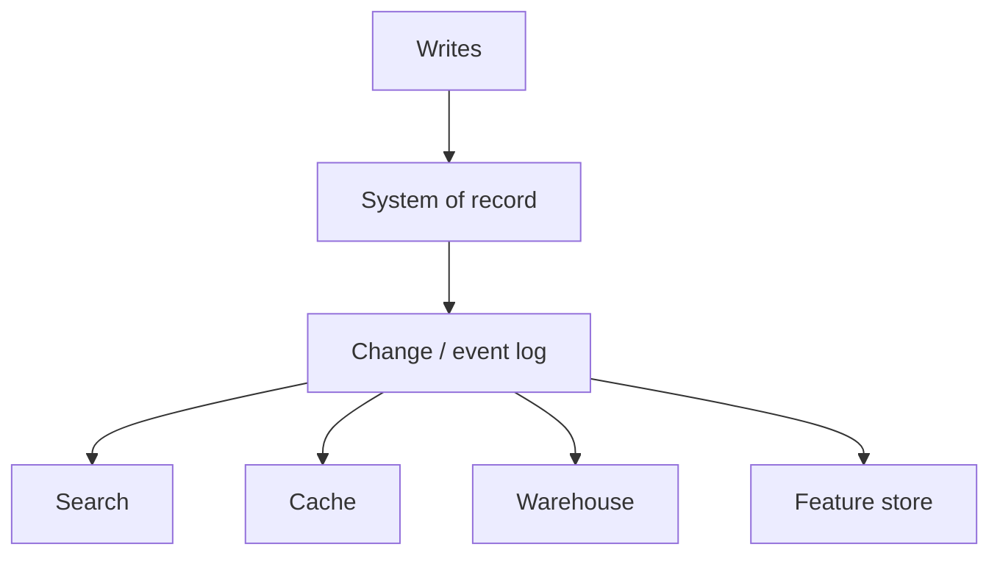

## Core ideas

No single database wins every access pattern — **compose** specialized systems.

Funnel writes into a **system of record**, then derive search, cache, analytics. Log-based derived data sits between heavyweight distributed transactions and chaotic dual writes.

**Unbundle the database**: loosely coupled storage, change log, and compute. Dataflow is one-way async (vs microservice RPC). Lambda architecture (batch + stream) works but costs operational complexity.

Correctness: idempotence end-to-end, request IDs through the pipeline, immutable messages. Split **timeliness** (eventual) from **integrity** (must not silently corrupt). **Audit** derived pipelines continuously.

Ethics: ML amplifies bias; do not retain data forever — immutability meets privacy via deletion/crypto access control.

## Picture



## Example

### End-to-end idempotency sketch

```java
public void handle(CreateOrder cmd) {
  String requestId = cmd.requestId(); // client-generated
  if (orders.existsByRequestId(requestId)) return; // duplicate suppress
  Order order = Order.from(cmd);
  orders.append(requestId, order); // single atomic message / row
  // downstream consumers derive views deterministically from the log
}
```

### Timeliness vs integrity

```text
Late search index update     -> timeliness miss (eventual OK)
Dropped payment event        -> integrity miss (catastrophic)
```

## Takeaways

- One writer-of-record; many derived readers
- Integrity > freshness; audit the pipeline
- Unbundled dataflow composes what one monolith DB cannot
