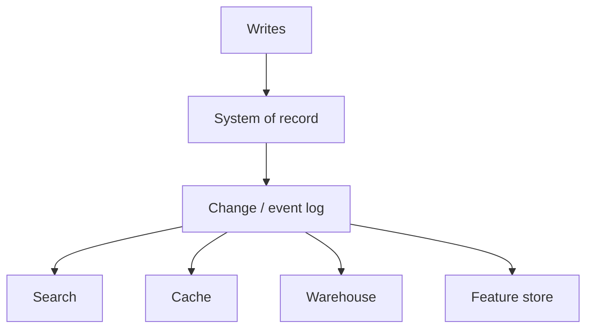
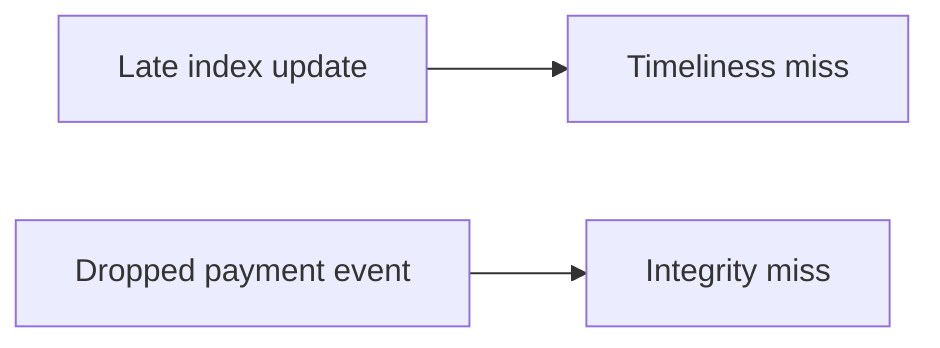

## Overview

No single database wins every access pattern. Kleppmann's sketch of the future is **composed**: a system of record, a log of changes, and specialized derived views, with correctness treated as an end-to-end property, not a checkbox on one product.

## Core ideas

### Data integration

Funnel writes into one **system of record** that decides write order; derive search, cache, warehouse, features from that log. Distributed transactions give linearizability at high cost; chaotic dual writes give races. Log-based derived data is the practical middle.

Batch and stream both favor functional, replayable dataflow. Derived views evolve gradually (old and new schemas side by side). Lambda architecture (batch + stream in parallel) works but costs operational complexity.

### Unbundling the database

Treat durable storage, change capture, and compute as loosely coupled parts that together behave like a database. One-way async dataflow differs from microservice request/response. The pattern extends to end-user devices.

### Aiming for correctness

Idempotence must be end-to-end (client request IDs through the pipeline). Split **timeliness** (eventual freshness OK) from **integrity** (silent corruption is catastrophic). Immutable messages + deterministic derivation + auditing beat blind trust in any single vendor guarantee. Event logs often audit better than opaque mutable rows.

### Doing the right thing

Systems have unintended consequences. ML amplifies bias in inputs. Immutability meets privacy: do not retain forever; deletion and cryptographic access control matter as much as replayability.

## Visual





## Code Example

*Snippets below use Java, SQL, or plain text as labeled.*

End-to-end idempotency sketch:

```java
public void handle(CreateOrder cmd) {
  String requestId = cmd.requestId();
  if (orders.existsByRequestId(requestId)) {
    return;
  }
  Order order = Order.from(cmd);
  orders.append(requestId, order);
  // downstream consumers derive views deterministically from the log
}
```

Timeliness vs integrity:

```text
Search index lags 30s     -> timeliness miss (usually OK)
Payment event never lands -> integrity miss (not OK)
```

## In short

One system of record, many derived readers. Integrity matters more than perfect freshness. Audit the pipeline instead of trusting any single store.
