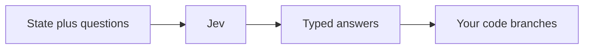
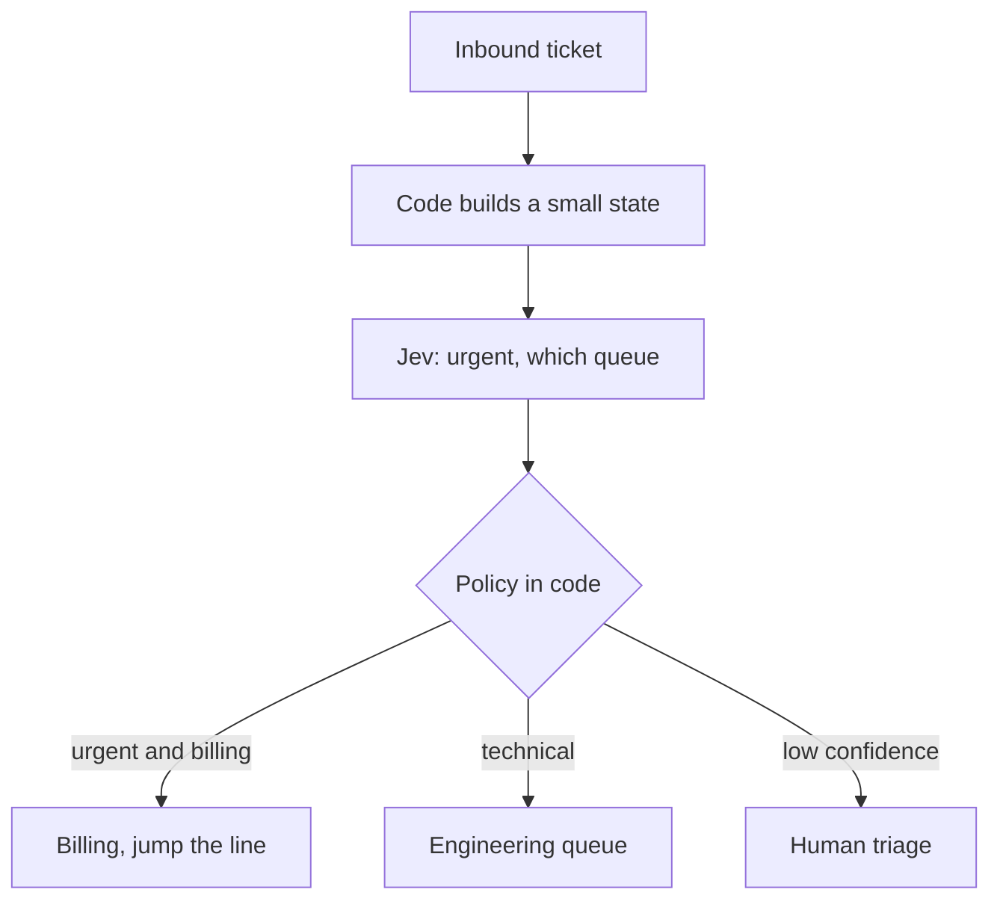
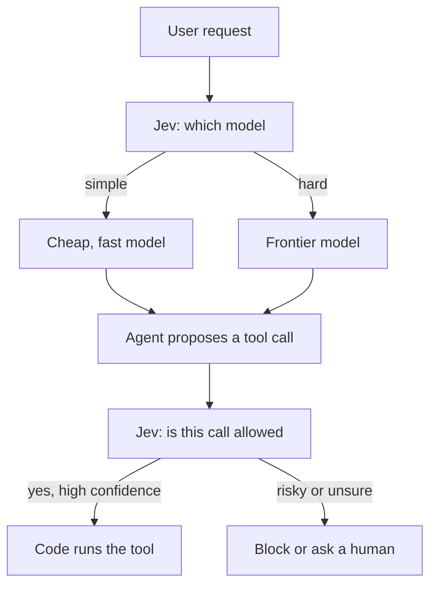
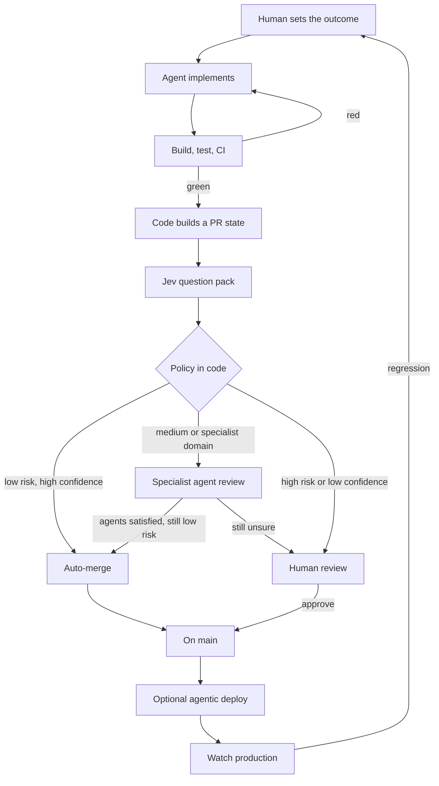
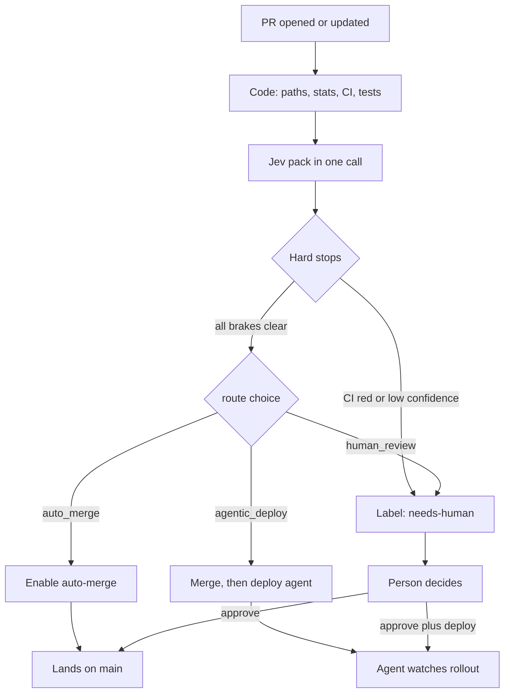

[TypeSafe](https://typesafe.ai/) shipped [Jev](https://typesafe.ai/blog/introducing-system-one-models-and-jev) last week. I have been waiting for something in this shape, even if I did not have a name for it.

Agents already write most of the boring code. CI already says whether the suite is green. The slow part is still a person staring at a diff and deciding if this one is safe enough to merge. At work we are already talking about that fork: auto-merge, or a human. Jev is interesting because it is built for that kind of question, and almost nothing else.

This is a sketch, not a rollout. Views here are my own.

## What it actually is

Jev is not another coding model. It does not write a review comment, a commit message, or a chat reply. TypeSafe calls it a **System One** model, after Kahneman's fast judgments. You send it a **state** (a ticket, a diff, a tool call, a blob of JSON) and a set of **typed questions**. It answers all of them in one round trip. Your code branches on the numbers.

Three question types:

- **Choice**: pick from a closed set. You get the winner, a probability for each option, and a confidence.
- **Score**: place the state on an ordered rubric. You get a score, the distribution over the levels, and a confidence.
- **Noul**: yes or no. You get a probability that the statement is true. (The name is theirs. Treat it as `P(yes)`.)

The useful property is the contract. Possible answers are defined before the call. The model cannot invent a fourth team, a new merge status, or a paragraph that you then have to parse. TypeSafe's claim is that this is also why it can be fast and cheap: no string generation, probabilities in parallel, output tokens too cheap to meter. They publish numbers like 70 to 500ms end to end and a couple of orders of magnitude cheaper than asking a frontier LLM the same questions. I have not reproduced those evals. The interface is still the part I care about.



Name origin, since people will ask: **Jevons**. Cheaper intelligence, more demand, not less. The model is the opposite of a chatbot on purpose.

What it is bad at, from their own jaggedness notes, matches the shape. Do not ask it to count lines, do arithmetic, compare dates, or write prose. Filter the state in code first. Put policy in code. Use a generative model when you actually need text.

## Simple uses

The first uses are the ones that already look like `if` statements we have been faking with an LLM.

A support ticket arrives. Code extracts the text. Jev answers "is this urgent" and "which queue" in one call. Your router puts it on a board. No generated reply required.



An agent is about to spend tokens. A lookup does not need the same model as a gnarly debugging session. [LangChain](https://www.langchain.com/blog/building-a-harness-with-jev) already has experimental middleware that asks Jev which model to use, and another that checks a tool call before it runs. Same idea: the LLM proposes, Jev judges, code executes or refuses.



That is already useful. The thing I actually want to build is the merge gate.

## The factory picture

[Gergely Orosz](https://newsletter.pragmaticengineer.com/p/openai-software-factory) wrote up how OpenAI is running what they call an **agentic software factory**. Human sets the outcome. Codex gathers context, writes the change, babysits CI until the PR is green, then a set of specialist review agents look at it through different lenses. Risk classifies the path. Low-risk areas can auto-approve. High-risk still needs a person. After a human says the change may go to production, another agent handholds the deploy: watches the graphs, even builds its own dashboard. Production signals feed back into the next loop. Incidents still have a human on the mitigation trigger, at least for now.

[OpenAI's own harness post](https://openai.com/index/harness-engineering/) is the other half: the model was capable earlier than the environment. The job became tools, abstractions, and feedback loops, not "try harder."

I am not OpenAI. I do not have a perf factory or a Sevbot. The transferable bit is the pipeline, and the fact that **risk is a routing problem**. If every PR still needs a human, the factory just moves the queue. If some PRs can go through without one, you have to be honest about who is allowed to make that call, and what evidence they saw.

That is the Jev-shaped hole.



OpenAI still puts a human in front of production for a lot of this. The experiment at a normal company is narrower: can we skip the human **reviewer** on a subset of green PRs, and still require a person for anything with blast radius? Auto-merge is not the same as auto-deploy. Those should be two gates.

## How the PR gate should work

Do not send Jev the whole repo and ask "ship it?" That is how you get a confident shrug.

**Code enumerates. Jev judges. Policy decides.**

1. Collect a small state in code. Title, body, author, labels, changed paths, diff stats, languages, whether tests moved with the code, CI conclusion, required checks, linked issue, whether the author is a bot. Parse the patch. Count files in code, not in the model. If the diff is huge, slice it and combine answers conservatively.
2. Ask a pack of narrow questions. Each one should be something a careful reviewer could answer in a few seconds from that state.
3. Combine the answers with boring rules. A high "looks fine" and a high "needs a human" can both be true. Do not average them into a mystery score.
4. Fail closed. Low confidence is a human. Missing CI is a human. Jev being down is a human.

A pack I would start with:

| Question | Type | What it is for |
| --- | --- | --- |
| `route` | Choice | `auto_merge`, `agentic_deploy`, `human_review` |
| `needs_human` | Noul | Independent of the choice. Policy should require this to be low before skipping a person. |
| `has_security_concern` | Noul | Secrets, auth, crypto, user data. |
| `touches_public_contract` | Noul | APIs, schemas, CLI flags, stored formats callers depend on. |
| `tests_cover_the_change` | Noul | Tests added or updated for the behavior that changed. |
| `blast_radius` | Score | Docs-only up through "this can wake someone at 3am." |
| `safe_to_merge` | Noul | Only after CI is green. Still not a merge button by itself. |

The `route` choice is a preference. The nouls are the brakes. Something like:

- CI green is mandatory. Jev never overrides a red check.
- `has_security_concern` or `touches_public_contract` above a threshold: human. Always.
- `blast_radius` at the top of the rubric: human. Always.
- `needs_human` high, or any Choice/Score confidence below the dial (start at 0.9): human.
- Otherwise, if `route` is `auto_merge` and `safe_to_merge` is high: enable auto-merge. A person does not have to look.
- `agentic_deploy` is a separate label, not a synonym of merge. It means: after merge (or on a workflow_dispatch), start a deploy agent that watches the rollout and does not get to press the scary buttons without a runbook. Production still has its own policy.



Specialist review agents still make sense on the middle path. Infra lens, security lens, data lens. Those can be generative. Jev is the thing that decides whether you bother a person at all. I would not let a specialist agent be the only merge approval unless the same brakes still pass.

People are already poking at slices of this. MetalBear has a [Jev auto-approve Action](https://github.com/metalbear-co/jev-auto-approve). There is [jevtriage](https://pypi.org/project/jevtriage/). That is the right altitude: a gate, not a new IDE.

## What I would not do

I would not let Jev write the deploy. I would not let it execute a mitigation. I would not hide the probabilities in a pretty "LGTM." Put the answers on the PR as a comment or check so a human can disagree with the policy, not with a vibe.

I would not start on the payments service. Start on docs, lockfile noise, generated snapshots, internal tests. Log every decision for a month. Only then move the confidence dial, and only on paths you can revert without a war room.

Jev is also not a prompt-injection shield by itself. Their notes say adversarial content can steer it. Treat PR bodies and diffs as untrusted input. Keep the instructions and criteria in your repo, not in the state.

## A GitHub project, when I get to it

I would rather this exist as a small repo than as a slide. The product is a CLI plus a GitHub Action: build the state, call Jev, apply policy, label the PR, optionally enable auto-merge, optionally kick a deploy workflow. Dry-run by default. No merge while checks are pending.

Below is the prompt I would paste into Cursor (or Codex) in an empty repo. That is how this becomes a real project on GitHub later: run the prompt, get a `README`, an Action, tests, and a policy file I can argue about in review.

```text
Build a small open-source GitHub project named factory-gate.

Purpose
A decision gate for an agentic software factory. Coding agents open PRs. CI stays the hard merge requirement. This project asks TypeSafe Jev a pack of typed questions about a PR and then applies policy in code: label the PR, leave a public scorecard comment, and optionally enable auto-merge or dispatch an agentic-deploy workflow. Jev never merges, never deploys, never writes application code, and never generates review prose. Code enumerates facts. Jev judges. Policy decides.

Product principles
- Fail closed. Missing CI, API errors, low confidence, or contradictory answers route to human review.
- Two gates, not one. auto-merge is not agentic-deploy. Deploy is a separate label plus an optional workflow_dispatch.
- Policy lives in versioned TypeScript (or Python) that unit tests can exercise without calling Jev.
- Dry-run is the default in the Action. Writes (labels, comments, auto-merge, dispatch) need an explicit input.
- Never use Jev for counting, arithmetic, dates, or text generation. Parse the diff with git/octokit. Count files and lines in code. Send Jev a compact state.
- Treat PR title, body, and diff as untrusted data. Keep question instructions and criteria in repo files, not in user-controlled text.
- Pin the Jev model version. Log model, raw answers, policy version, and git SHA.

Stack
- TypeScript, Node 22, pnpm.
- GitHub Action (JavaScript, bundled) plus a CLI (`factory-gate`) with the same core.
- Call TypeSafe at POST https://api.typesafe.ai/v1/systemone with TYPESAFE_API_KEY. Support question types choice, score, and noul.
- Use octokit for GitHub. GITHUB_TOKEN for reads and labels. A separate token input for enabling auto-merge or creating reviews if required, because the default token often cannot satisfy protected-branch approvals.
- Tests with node:test or vitest. Mock the Jev HTTP call. Golden fixtures of PR states.

Repo layout
- README.md: what it is, what it is not, a mermaid of the gate, required secrets, a copy-paste workflow, how to tune thresholds, threat model.
- ACTION.md or README section: inputs, outputs, permissions.
- src/github/state.ts: build the PR state (files, stats, CI, labels, author association, linked issues).
- src/diff/parse.ts: parse patch, list paths, detect likely tests vs prod, detect lockfiles/docs.
- src/jev/questions.ts: the default question pack (editable YAML also fine if schema-validated).
- src/jev/client.ts: typed client.
- src/policy.ts: pure function (answers + facts) -> Decision.
- src/apply.ts: labels, comment, auto-merge, workflow dispatch.
- src/cli.ts and src/action.ts.
- test/ with fixtures.
- examples/workflow.yml.
- LICENSE MIT.

Default question pack (all in one Jev call)
- route: choice of auto_merge | agentic_deploy | human_review. Criteria must describe each option in operational terms.
- needs_human: noul. Phrase the true side as reasons a person must look. Missing evidence should push toward true.
- has_security_concern: noul (secrets, auth, crypto, PII, injection).
- touches_public_contract: noul (HTTP API, exported types, schemas, CLI flags, config keys callers depend on).
- tests_cover_the_change: noul. Docs-only and comment-only changes should be allowed to score as not-applicable in policy, not as a fake yes.
- blast_radius: score with concrete levels from "docs or comments only" up to "can cause a customer-facing incident".
- safe_to_merge: noul, only meaningful when CI is green; policy must ignore it otherwise.

Default policy (all thresholds in one config file)
1. If CI is not success: human_review. Stop.
2. If has_security_concern.noul >= 0.5: human_review.
3. If touches_public_contract.noul >= 0.5: human_review.
4. If blast_radius is at or above the "incident" level: human_review.
5. If any choice/score confidence < 0.9: human_review.
6. If needs_human.noul >= 0.5: human_review.
7. If safe_to_merge.noul < 0.9: human_review.
8. Else honor route when it is auto_merge or agentic_deploy.
9. agentic_deploy still requires the merge brakes above. It only adds a label and optional workflow_dispatch after merge eligibility.
10. Never average needs_human with safe_to_merge.

GitHub behavior
- Labels: factory-gate:human-review, factory-gate:auto-merge, factory-gate:agentic-deploy, plus a confidence label optional.
- Sticky PR comment with the scorecard (question, answer, probability/confidence) and the policy rule that fired. No LLM-written summary.
- Outputs for other workflow jobs: decision, confidence, model, reason.
- Optional: enable GitHub auto-merge (squash) only in apply mode when decision is auto_merge or agentic_deploy.
- Optional: dispatch a named workflow for agentic deploy. The dispatched workflow is out of scope except for a stub example that comments "deploy agent would start here".
- Permissions documented: pull-requests: write, contents: read, checks: read, actions: write only if dispatch is enabled.

CLI
factory-gate evaluate --pr 123 --repo owner/name --dry-run
factory-gate evaluate --pr 123 --apply
Exit codes: 0 auto_merge or agentic_deploy, 1 human_review, 2 error.

README must include
- A mermaid flowchart of the gate.
- "This does not replace CI."
- How to start on docs-only PRs.
- Link to TypeSafe Jev docs and to the idea of an agentic software factory (Pragmatic Engineer / OpenAI harness engineering) as inspiration, not as affiliation.
- A section "paste this into a coding agent to extend the question pack" so the repo can grow.

Implement the real code, tests, and example workflow. Do not stub the policy. Do not call Jev in unit tests.
```

If I do publish that repo, I want the first version to be embarrassing in the right way: docs PRs only, dry-run, a scorecard nobody is ashamed to show a security engineer. The factory is the loop. Jev is just the cheap, typed fork in the middle.
