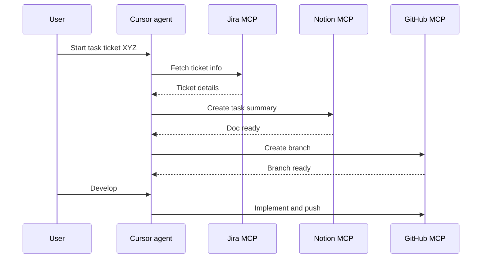
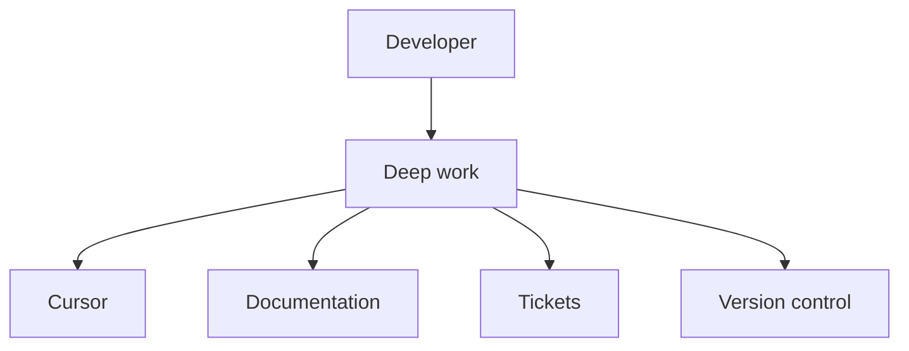

This is the writeup of the talk I gave at [Sword AI Summit](https://aisummit.swordhealth.com/) on 15 November 2025. The talk was called **Building Real AI Workflows for Software Engineers**. [Hello world](/meta/hello-world/) is how that day felt. This is what I actually showed.

## The bottleneck

Most of us still treat AI like a second monitor. Editor on one side, chat on the other. Ticket in Jira. Docs in Notion. PR in the browser. You spend the afternoon pasting context and hoping nothing got lost.



The interesting part is not "AI can write a function." It is taking the repetitive loop (**read ticket**, **touch code**, **update docs**, **open PR**) and keeping it in one place.

## Cursor as the place work happens

[Cursor](https://cursor.com/) puts the model in the editor. Same files, same git, same terminal. You stop copying. The model can see the repo, so you stop explaining the repo. That is the whole pitch.

I published the setup I use as a template: [`ai-workflow-cursor-config`](https://github.com/pmagnomuller/ai-workflow-cursor-config).

Out of the box, Cursor writes like a generic Stack Overflow answer. **Cursor Rules** are how you fix that. Project rules live in the repo and travel with the team. User rules are your own habits. Skip this step and the model keeps sounding like everyone else.

## MCP: stop being the integration layer

[MCP](https://modelcontextprotocol.io/) (Model Context Protocol) is how other apps feed context into the model. Tickets, docs, version control. You do not paste a Jira page into the chat. You say "start this ticket" and it can fetch it.



In my setup:

- **Jira** and **Notion** go through MCP with browser login
- **GitHub** stays in Cursor's own integration with a personal access token

Without MCP you are still the courier. With it, the editor reaches those tools for you.

## The workflow I actually use

From inside Cursor I give it a ticket id. It pulls the ticket, drafts documentation for the work, opens a branch, and I implement from there. When the change is ready, docs and the PR come with it. That is what made me faster as a software engineer: less tab switching, more time on the hard decisions.



Same idea as a sequence, without the slide chrome:

The model does **not** merge. I do. That part is not optional.

## Why this matters



Setup takes an evening. The first week feels slower, not faster. Some days you revert the whole thing. It stuck for me because the busywork left the browser. Rules made the output look like my code. MCP meant I stopped pasting tickets.

If you want the template, fork [ai-workflow-cursor-config](https://github.com/pmagnomuller/ai-workflow-cursor-config) and delete what you do not use. I write later about how this grew into a [shared skills library](/ai/my-ai-coding-setup/) across Cursor, Claude Code, and Codex.
