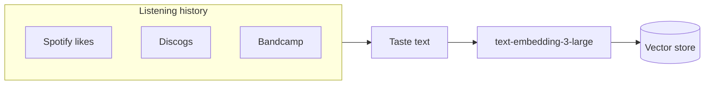
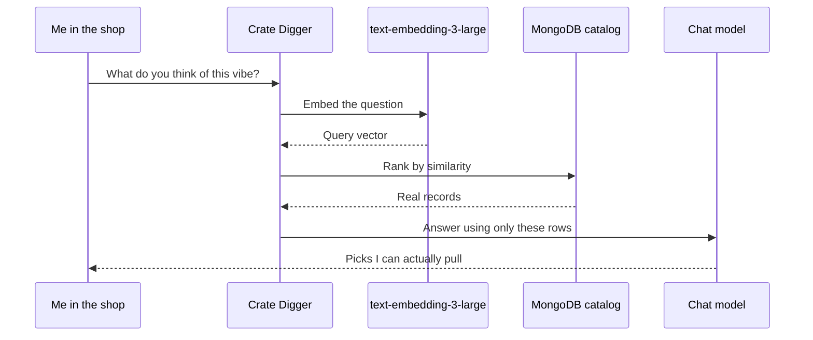
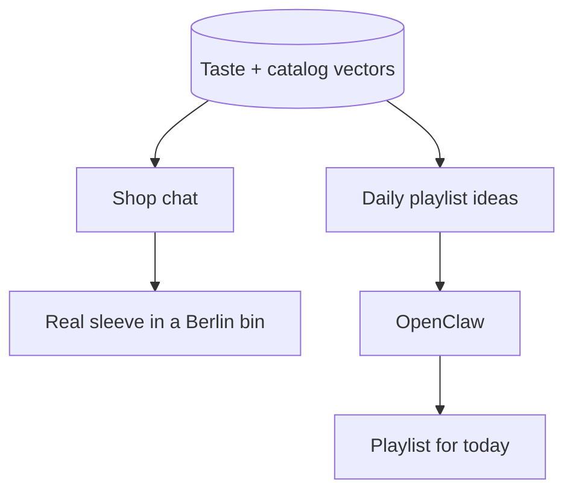

I dig vinyl in Berlin. I also DJ with analog records. The shops are great until Saturday, when the person behind the counter has three people waiting and zero minutes for “something like this, but warmer.” You can describe the mood. The bins do not speak that language. Discogs helps if you already know the title. Taste is fuzzier than that.

[AI Crate Digger](https://github.com/pmagnomuller/ai-crate-digger) started as a learning project with a selfish use case. I wanted to understand **RAG** properly — not the slide version, the one where you control what the model is allowed to know. Embeddings. A vector store. A chat layer that has to ground itself in real rows. The app was the excuse. Standing in a shop with a sleeve in my hand and asking “what do you think of this?” was the point.

## Why bother

Generic music chat will invent pressings. That is useless when you are staring at a crate. If it cannot point at a title that is actually in the collection you care about, it should shut up. So the rule from day one: **retrieve first, talk second**. The model is not the catalog. The catalog is.

I also wanted a taste model that felt like mine. Not “users who bought X also bought Y.” My listening history. The records I already trust.

## Building a taste corpus

I pulled everything I could find about what I had already heard:

- **Spotify** liked songs and playlists through their API — years of “this is what I actually press play on”
- **Discogs** — collection, wants, release metadata in the language record shops already use
- **Bandcamp** and whatever else I could scrape or export from past listening

That pile became text. Artist, title, genre, label, notes I cared about. Then each chunk went through an embedding model. On Azure OpenAI that deployment is **`text-embedding-3-large`** — OpenAI’s text embedding model, the large one. You send a string. You get back a long vector. Songs and releases that “mean” similar things land near each other in that space. That was the important lesson for me: you are not teaching the chat model your taste in the prompt. You are parking your taste as geometry, then asking questions against it.

Separately, the **shop-facing catalog** is seeded from Discogs releases into MongoDB. Same embedding model. Artist, title, genre, label become a vector stored next to the document. So I end up with two related ideas in the same shape of data: what I already like, and what is on the shelf I am querying.

## How a question turns into a pick

When I ask something in the shop — “warm deep house under thirty,” “close to this sleeve,” “what should I hear tonight” — the app does not freestyle a recommendation. It embeds the question with the same model, compares that vector to the stored ones (dot product ranking in MongoDB), and hands the chat model only the hits. Chat can call tools like `search_records` and `get_record_detail`. It explains the picks. It is not allowed to invent the rows.

That loop is the RAG people draw on whiteboards, just aimed at wax:

Under the hood it is NestJS, MongoDB with embedding arrays on the documents, Azure OpenAI for chat (`gpt-4o-mini` in my setup) and embeddings, a small Vite client for local digs, Docker, CI into Azure Container Apps. None of that is the interesting constraint. The interesting constraint is inventory. Recommendations have to land on titles you can pull.

## What I use it for

In the shop: companion mode. Sleeve in hand, short chat, candidates grounded in the catalog. Mood, budget, similar-to-this. Answers stream back. Optionally Spotify-shaped taste can tilt retrieval toward what I already play — I am still careful how hard I lean on that when the bins are a shop’s stock, not my shelf.

At home the next step is playlists. Same vectors, different question: “what should I hear today?” Wire that into [OpenClaw](/homelab/openclaw-on-my-homelab/) so the homelab agent can read the taste store and draft a daily mix without me rebuilding context every morning. The crate digger teaches the geometry. OpenClaw is the channel I already talk to from the couch.

## What I actually learned

Embeddings are how you get a say in what “similar” means. RAG is how you keep the model honest. The hard part is not calling the API. It is deciding what text goes into the vector, how much Spotify should steer a Saturday afternoon in someone else’s shop, and when silence is better than a confident wrong title.

This is still a working lab: seeding, retrieval quality, playlist export, how far OpenClaw should go on its own. The repo is public if you want to poke at it. I will keep writing as the recommendations get good enough that I trust them with a crate I paid for.
