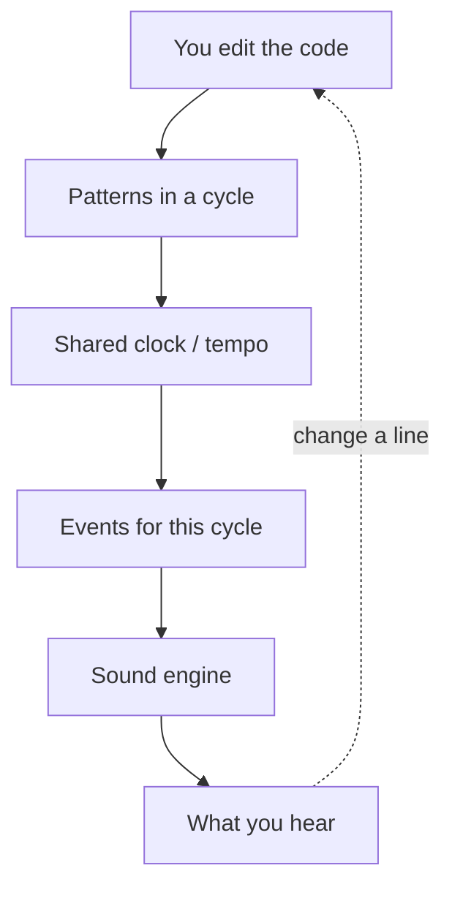

I have always liked music. I have always wanted to *make* music. For a long time that lived in the same mental drawer as “someday”: guitars I did not practice enough, Ableton sessions that never became a track, playlists that grew while the blank project sat open.

What makes me excited now is that the software for writing music *as code* is no longer a niche hobby you need a research lab to touch. It shows up in classrooms, in nightclubs, on Instagram Reels where someone sings with a guitar and a tiny code snippet fires the piano and drums behind them. Coding and composition in the same breath. That frontier is moving, AI is shoving it along, and I am happily watching where it goes, because it makes the old split feel fake. There is beauty in the answer. There is also beauty in the method of arriving there. A lot of engineers are artists. A lot of artists are engineers. Live coding is one of the places that becomes obvious.

## What it actually is

You write code. Sound comes out while you type. You change a loop, the loop changes. There is no separate “press play” in the usual DAW sense. The edit *is* the performance.

Under the hood the idea is simpler than the demos look. A **clock** keeps time in **cycles** (think bars that keep coming around). You describe **patterns**: this kick every beat, this bass on the offbeats, this sample but only sometimes. Patterns stack. You transform them: faster, slower, reversed, every third hit. Those patterns become timed events. Something has to turn events into audio. Often that is [SuperCollider](https://supercollider.github.io/) (especially via SuperDirt in the Tidal world). In the browser it can be Web Audio instead. You are not drawing a timeline first. You grow a loop until it has a shape, then another, then you duck the bass under the kick by editing text.

That loop (write, hear, rewrite while it is still running) is the whole instrument.

## Sonic Pi: where a lot of people start

For me the lineage starts with **[Sonic Pi](https://sonic-pi.net/)**, built by **[Sam Aaron](https://twitter.com/samaaron)** while he was at the **University of Cambridge**. He made it so kids could learn programming and music at the same time. Ruby-ish syntax, friendly enough for a classroom, serious enough that people started making real tracks and playing clubs with it. That combination is what hooked me: not “learn to code, then maybe do art later,” but art *as* the reason to code.

If you have never seen it, watch him do it. This TEDx talk is still one of the cleanest introductions. Programming as performance, live loops mutating in front of you:



That is the door. A teaching tool that escaped the classroom and became a musical instrument.

## TidalCycles and the long improvisations

Alongside that world, and feeding the scene that calls itself [Algorave](https://algorave.com/), is **[TidalCycles](https://tidalcycles.org/)** (Tidal), started by **[Alex McLean](https://slab.org/)**. Patterns are the whole language. SuperCollider / SuperDirt usually sit underneath as the synth engine. You live inside cycles. You improvise by rewriting the score while the score is already playing.

There are long videos of people doing this for real. Not a five-minute demo. An actual set. Hours of code, headphones, and a room that follows the mutations. This Tokyo / Yorkshire Algorave stream is one of those rabbit holes:



And a full TidalCycles livecoding set from Algorave Moscow:



You do not need to understand Haskell to get the point. Watch someone hold a groove with text for forty minutes. The craft is in the timing of the edits.

## Strudel and DJ_Dave

**[Strudel](https://strudel.cc/)** is roughly Tidal’s ideas living in the browser: same pattern brain, no install fight, a link you can send a friend. That is why it spreads. [DJ_Dave](https://www.youtube.com/@dj_dave____) is the person who made Strudel click for me. Dance music written live, patterns rewritten in real time, the floor (or the bedroom) following the cursor.



And more of the process, how a file is laid out so you can throw a live set around: kicks, sidechain, stems in and out.



I bounce between Sonic Pi, Tidal, and Strudel. I have a [strudel playground](https://github.com/pmagnomuller/strudel-playground) sitting around for that reason. Nothing there is a release yet. That is fine. The point of this post is not a finished EP. It is the feeling that the tools finally match an old wish.

## Where this sits for me

I am not throwing Ableton away. Live coding is another instrument in the same room. Link so the clocks agree. Jam in Strudel or Tidal until it feels like a track, bounce it, finish in the DAW. Or stay in the text and treat the edit as the show.

What I keep noticing in feeds is the same mash-up: a singer, a guitar, a few lines of code holding the rest of the band. AI will keep pushing how fast you can sketch a sound. The part that stays interesting is taste. What you keep, what you delete, when you stop the loop. That is the same muscle as writing software you are proud of.

I want a small release someday. One track, maybe a handful. Until then I am just glad this corner of software exists, that Sam Aaron built a door for kids that adults still walk through, and that a night of improvising with patterns on a screen can feel as much like art as any studio session.

If you want a rabbit hole: start with Sam’s talk, then one of the long Algorave sets, then DJ_Dave in Strudel. I will write again if something actually comes out.
