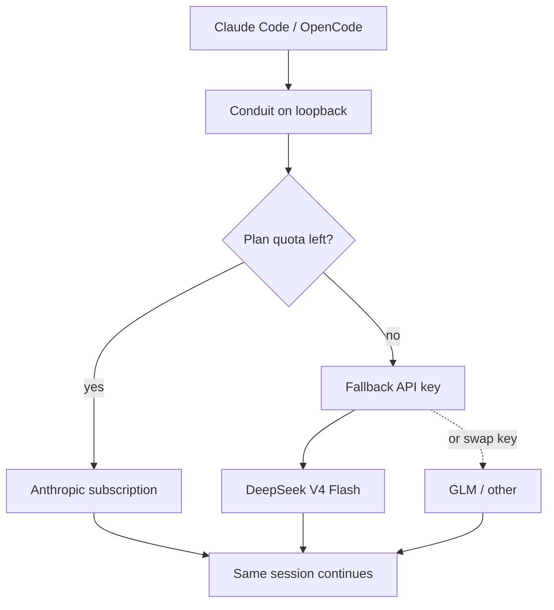

I like Claude Code. I like staying in one harness, with the same context and the same memory of the session. What I do not like is what happens after the Anthropic subscription window is gone: keep typing on the same tool, and you start burning the expensive path — usage after the plan limit that costs way more than a normal API call to a cheaper model.

[Conduit](https://github.com/pmagnomuller/conduit) is a small loopback gateway that sits between the agent and the providers so I do not have to care about that mid-flow. Claude Code (and [OpenCode](https://opencode.ai/) if I wire it) still talks Anthropic-shaped HTTP. Conduit decides where the request actually goes.

## The problem in one sentence

Subscription first. When the plan says stop, switch the key — not the tool.

Spending tokens on Anthropic *after* the usage limit is much more expensive than continuing on a DeepSeek API key and finishing the thought. I do not want to open another app, paste context, lose the session, or babysit a model picker. Same harness. Same conversation. Same memories. Even if the agent is mid-thought when the quota trips, the next hop should just cost less.

## What it does

While the Claude plan still has capacity, every request goes to Anthropic as usual. Conduit watches for real plan-quota signals — not every random `429`, the ones that mean *your usage window is done*. When that fires, it opens a circuit breaker and transparently replays the request on a fallback provider.

Right now my default fallback is **DeepSeek V4 Flash**. Earlier I used **GLM 5.3** the same way. The point of the gateway is that those are just API keys you can swap: pin a provider, change the model map, keep the agent pointed at `127.0.0.1`. When the quota window resets, Conduit probes Anthropic again and switches back on its own.

Compatible with Claude Code out of the box (`ANTHROPIC_BASE_URL` aimed at the gateway). Also wireable for OpenCode — same Anthropic wire protocol, same door. I stay in the agent I already use. The company stays off the surprise invoice. Everyone in that loop spends less when the plan is empty.

## Why bother

This is not a new idea. Token spend is geometric: a long agent session after the soft limit is a different price curve than the same session on a cheap flash model. People are already juggling keys by hand. Conduit is just making the juggle automatic and boring.

I do not know yet if this stays a private tool or turns into something more serious. I do believe the direction is right. Use the subscription while it is the good deal. When it is not, keep working — on a key that matches the economics — without leaving the harness.

Views here are mine. This is how I run my own coding agents, not a vendor pitch. If you are already paying for Claude and then paying again the expensive way when the bar turns red, you already feel the shape of the problem.
